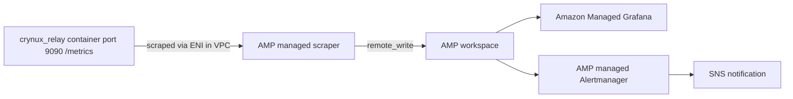

# Monitoring

This document specifies the Prometheus metrics exposed by Relay, the forensic lifecycle fields that back them, and the AWS-managed scrape, storage, dashboard, and alerting deployment.

## Metrics Endpoint

Relay MUST serve Prometheus metrics at `GET /metrics` on a dedicated HTTP port that is separate from the public API port. The endpoint MUST expose only the Relay application metrics defined in this document from a dedicated Prometheus registry.

Configuration:

| Key | Type | Meaning |
|-----|------|---------|
| `metrics.enabled` | bool | Enables the metrics server and the gauge collector. |
| `metrics.port` | string | Port for the metrics HTTP server. Required when metrics are enabled. |
| `metrics.vram_tiers` | list of integers | Ascending VRAM tier boundaries in GB used for the `vram_tier` label. Required when metrics are enabled. |

The metrics port MUST NOT be exposed publicly. It MUST be reachable only from inside the VPC through security group rules.

## Label Derivation

Metric labels MUST stay low-cardinality. Per-node breakdowns stay in the database and MUST NOT appear as metric labels.

| Label | Derivation |
|-------|-----------|
| `task_type` | `sd`, `llm`, or `sd_ft_lora` from the task type enum. |
| `creator` | The task creator address. Creators are whitelist-controlled, so cardinality is bounded. |
| `vram_tier` | The task `MinVRAM` mapped to the configured `metrics.vram_tiers` boundaries, producing labels `0-8`, `8-16`, ..., `48+`. Raw VRAM values MUST NOT be used as labels. |
| `gpu` | The exact `RequiredGPU` name for GPU-pinned tasks, `any` otherwise. |
| `reason` | Task abort reason: `none`, `timeout`, `model_download_failed`, `incorrect_result`, or `task_fee_too_low`. |
| `phase` | Pipeline phase reached before an abort, derived from lifecycle timestamps: `queued` (no `StartTime`), `undelivered` (started, no `DeliveredTime`), `delivered` (delivered, no `ScoreReadyTime`), `scored` (score submitted). |
| `status` (task) | Terminal status: `success`, `group_success`, `group_refund`, or `invalidated`. |
| `status` (node) | Node status: `quit`, `available`, `busy`, `pending_pause`, `pending_quit`, or `paused`. |
| `event` | Node lifecycle event: `join`, `quit`, `kickout`, or `slash`. |

## Counters and Histograms

Counters and histograms MUST be incremented at the task and node state transition points after the corresponding database transaction commits.

| Metric | Type | Labels | Increment point |
|--------|------|--------|-----------------|
| `relay_tasks_created_total` | counter | `task_type`, `creator` | `CreateTask` succeeds. |
| `relay_tasks_dispatched_total` | counter | `task_type` | `SetTaskStatusStarted` succeeds. |
| `relay_tasks_delivered_total` | counter | none | The selected node fetches the task for the first time and `delivered_time` is recorded. |
| `relay_tasks_error_reported_total` | counter | none | `SetTaskStatusErrorReported` succeeds. |
| `relay_tasks_terminal_total` | counter | `status`, `task_type` | Task reaches `TaskEndSuccess`, `TaskEndGroupSuccess`, `TaskEndGroupRefund`, or `TaskEndInvalidated`. |
| `relay_tasks_aborted_total` | counter | `reason`, `phase` | `SetTaskStatusEndAborted` succeeds. |
| `relay_task_queue_wait_seconds` | histogram | `task_type` | Observes `StartTime - CreateTime` on dispatch. Buckets: 1, 2, 5, 10, 30, 60, 120, 300, 600, 1800. |
| `relay_task_execution_seconds` | histogram | `task_type` | Observes `ScoreReadyTime - StartTime` on score submission. Buckets: 5, 10, 30, 60, 120, 300, 600, 1200, 1800, 3600. |
| `relay_node_selection_candidates` | histogram | `task_type`, `vram_tier`, `gpu` | Observes the final candidate pool size in `selectNodeForInferenceTask`, including 0 for the empty-pool branch. Buckets: 0, 1, 2, 5, 10, 20, 50, 100, 200. |
| `relay_node_selection_empty_total` | counter | `task_type`, `vram_tier`, `gpu` | Node selection finds no candidate node. |
| `relay_node_health_penalties_total` | counter | none | `ApplyHealthPenalty` succeeds. |
| `relay_node_events_total` | counter | `event` | Node join, quit, kickout, or slash completes. |

The average candidate pool size for a task class is the PromQL expression `rate(relay_node_selection_candidates_sum[5m]) / rate(relay_node_selection_candidates_count[5m])` grouped by labels; Relay MUST NOT compute averages itself.

## Gauge Collector

When metrics are enabled, Relay MUST run a gauge collector goroutine on a 30-second tick that refreshes the following gauges from database queries:

| Metric | Labels | Value |
|--------|--------|-------|
| `relay_task_queue_depth` | none | Count of tasks in `TaskQueued` status. |
| `relay_nodes` | `status` | Count of nodes per node status. Every status label MUST be set on every tick, including zero values. |
| `relay_nodes_failing_30m` | none | Count of distinct `selected_node` values on tasks with `TaskEndAborted` status, `TaskAbortTimeout` reason, and an update time within the last 30 minutes. This gauge discriminates systemic node failure from individual node failure. |
| `relay_nodes_alive` | none | Count of nodes with `last_seen_time` within the last 2 minutes. |

A query failure for one gauge MUST be logged and MUST NOT prevent the other gauges from refreshing.

## Delivery and Last-Seen Tracking

### Task `delivered_time`

The `inference_tasks` table carries a nullable `delivered_time` column recording the first time the selected node fetched the task.

When `GET /v1/inference_tasks/:task_id_commitment` is called by a signer equal to the task's `selected_node` and `delivered_time` is null, Relay MUST set `delivered_time` with a single conditional UPDATE (`WHERE delivered_time IS NULL`) so concurrent fetches record the delivery exactly once, and MUST increment `relay_tasks_delivered_total` only when the UPDATE changes a row. A `delivered_time` write failure MUST be logged and MUST NOT fail the task fetch request.

`delivered_time` distinguishes tasks the node never fetched (`undelivered` abort phase) from tasks the node fetched but never finished (`delivered` abort phase).

### Node `last_seen_time`

The `nodes` table carries a nullable `last_seen_time` column recording the last time the node polled Relay for its current task.

`GET /v1/nodes/:address/task` MUST refresh `last_seen_time`. Nodes poll every second, so the database write MUST be throttled through an in-memory per-node map to at most one write per node per 60 seconds. A `last_seen_time` write failure MUST be logged and MUST NOT fail the poll request.

## AWS Deployment

Metrics are consumed with fully managed AWS services. No self-hosted Prometheus or Grafana instance runs on Relay hosts.



### Setup Runbook

1. Expose the metrics port on the Relay host:
   - Map port 9090 in the Relay `docker-compose.yml`.
   - Add an EC2 security group rule that allows inbound TCP 9090 from the scraper's security group only. The port MUST NOT be open to the public internet.
2. Create the Amazon Managed Service for Prometheus workspace:

```bash
aws amp create-workspace --alias crynux-relay
```

3. Create the fully managed agentless scraper with a VPC source configuration pointing at the Relay VPC's subnets and security groups, and a scrape configuration statically targeting the Relay host's private IP or private DNS name on port 9090 with a 15-second scrape interval:

```bash
aws amp create-scraper \
  --alias crynux-relay-scraper \
  --source vpcConfiguration="{subnetIds=[<relay-subnet-ids>],securityGroupIds=[<scraper-sg-id>]}" \
  --scrape-configuration configurationBlob=$(base64 -w0 scrape-config.yml) \
  --destination ampConfiguration={workspaceArn=<amp-workspace-arn>}
```

`scrape-config.yml`:

```yaml
global:
  scrape_interval: 15s
scrape_configs:
  - job_name: crynux-relay
    static_configs:
      - targets: ["<relay-private-ip>:9090"]
```

4. Create the Amazon Managed Grafana workspace with IAM Identity Center authentication and add the AMP workspace as a Prometheus data source.
5. Create alert rules in the AMP managed Alertmanager, routed to an SNS topic with an email subscription:

| Alert | Expression | Meaning |
|-------|-----------|---------|
| Systemic node failure | `relay_nodes_failing_30m > 10` | Many distinct nodes are timing out on tasks at once. |
| Task creation stopped | `rate(relay_tasks_created_total[10m]) == 0` | The task source has stopped creating tasks. |
| Queue growth | `relay_task_queue_depth` sustained growth over 15 minutes | Dispatch is not keeping up with creation. |
| No candidate nodes | `rate(relay_node_selection_empty_total[5m]) > 0` | Tasks cannot be matched to any node. |

6. Build the starter Grafana dashboard with these panels:
   - Task creation rate vs terminal rate by task type.
   - Abort rate by `reason` and `phase`.
   - Task queue depth.
   - Nodes by status and alive node count.
   - Queue wait and execution latency histogram quantiles.
   - Node selection candidate pool size and empty-selection rate.

## Source Files

| File | Responsibility |
|------|----------------|
| `metrics/metrics.go` | Metric definitions, dedicated registry, label derivation helpers, metrics HTTP server |
| `metrics/collector.go` | 30-second gauge collector |
| `service/task_status.go` | Task transition counters and histograms, `MarkTaskDelivered` |
| `service/select_nodes.go` | Node selection candidate pool metrics |
| `service/qos.go` | Health penalty counter |
| `service/node.go` | Node lifecycle event counters |
| `service/node_last_seen.go` | Throttled node `last_seen_time` refresh |
| `api/v1/inference_tasks/get_task_by_id.go` | Task delivery recording on node fetch |
| `api/v1/nodes/get_node_task.go` | Node last-seen refresh on task poll |
| `migrate/migrations/m_20260712.go` | `delivered_time` and `last_seen_time` columns |
